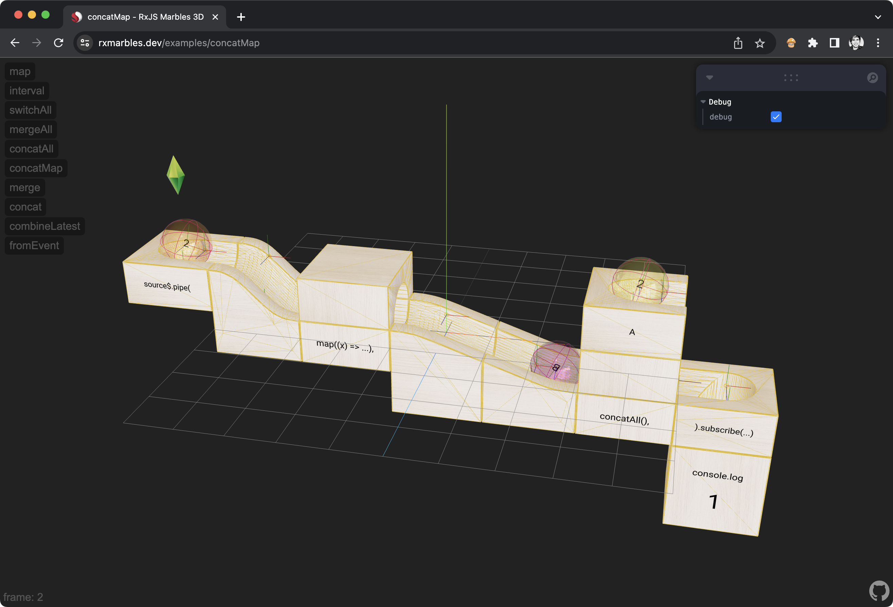
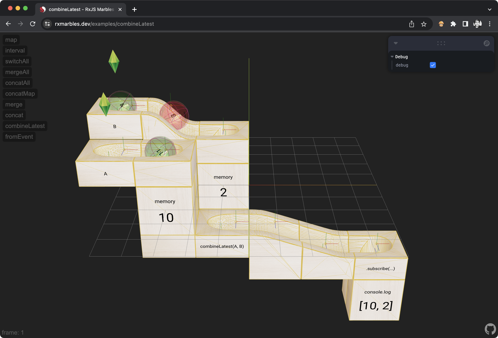

# RxJS Marbles 3D

Reactive programming in RxJS visualized with 3D marbles.

Checkout [rxmarbles.dev](https://rxmarbles.dev)


Demo: [ConcatMap](https://rxmarbles.dev/examples/concatMap)


Demo: [CombineLatest](https://rxmarbles.dev/examples/combineLatest)

**NOTE**: WORK IN PROGRESS 🚧

## Development

Start development server:

```sh
# start the remix dev server and wrangler
npm run dev
```

Open up [http://127.0.0.1:8788](http://127.0.0.1:8788) and you should be ready to go!

## Models

When making changes to the model in Blender, export it as follow:

- General: format gltf embedded
- Include: **selected** objects
- Transform: +Y up
- Geometry: Apply modifiers, UVs, Normals, Vertex Colors, Export Materials
- Animation: OFF

Run gltfjsx helper to generate JSX:

```sh
npx gltfjsx ./model.gltf --transform --keepnames --keepmeshes --types
```

Drag `object-transformed.glb` to public models folder.
Copy `Object.tsx`` to project, and edit to rename exports, and adjust loading paths.
